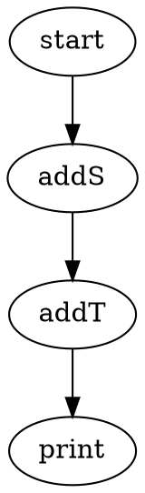

# Legion: An Asynchronous, Typesafe Task Graph Library for Kotlin

[](https://github.com/patbeagan1/legion/actions)
[](https://search.maven.org/search?q=g:%22io.github.patbeagan1%22%20AND%20a:%22legion%22)

Legion is a powerful Kotlin library for building and executing asynchronous, type-safe task graphs. It's inspired by the principles of Flow-Based Programming (FBP), allowing you to define complex workflows as a network of independent, reusable processing nodes.


## A Primer on Flow-Based Programming

Flow-Based Programming (FBP) is a paradigm where an application is viewed as a network of black-box processes. These processes, or nodes, communicate by passing structured data packets through predefined connections. This approach encourages breaking down complex problems into smaller, manageable, and decoupled components.

Systems like [Gradle](https://gradle.org/) use a Directed Acyclic Graph (DAG) to manage task dependencies for builds, ensuring tasks run in the correct order. Similarly, environments like [NoFlo.js](https://noflojs.org/) provide tools for building FBP applications in JavaScript. Legion brings this powerful paradigm to the Kotlin ecosystem, emphasizing type safety, asynchronicity with coroutines, and a flexible DSL for graph definition.

## Core Concepts

- **Legion:** The container for your task graph, defined within a `legion { }` block.
- **ImpNode (Imp):** The fundamental processing unit. It can be a simple lambda or a custom class that performs an action on its input and passes an output to the next node.
- **`..` (rangeTo):** An infix operator used to connect one node to another, defining the flow of data.
- **`start`:** A special node representing the entry point of the graph.

## Getting Started

### Basic Chains

You can create simple, linear sequences of operations. Data flows from the `start` node through each connected `imp`.

```kotlin
legion<String> {
    start..
        { it.plus("s") }..
        { it.plus("t") }..
        { it.plus("r") }..
        { println(it) }
}.accept("a") // Output: astr
```

### Forks and Joins

A graph can have multiple branches. A single node's output can be fed into several other nodes, allowing for parallel processing paths.

```kotlin
val print = Imp("print") { it: String -> println(it) }
val addS = Imp("addS") { it: String -> it.plus("s") }
val addT = Imp("addT") { it: String -> it.plus("t") }
val addR = Imp("addR") { it: String -> it.plus("r") }

legion {
    start..addS
    start..addR
    addS..addT
    addS..print // Fork from addS
    addT..print // Fork from addT
    addR..print // Fork from addR
}.accept("a")

// Possible output order:
// ar
// as
// ast
```

## Advanced Features

### Joining Nodes

Legion provides powerful mechanisms for joining multiple data streams.

#### Joining by Quantity (`impJoinAllQuantified`)

This node waits until it has collected a specific number of items of various types before it activates. It's perfect for scenarios like assembling components or gathering ingredients.

Here, the `bake cake` node will only execute after it has received 3 `Egg`s, 1 `Sugar`, 1 `Flour`, and 1 `Milk`.

```kotlin
// Define the ingredients
sealed class Ingredient {
    class Egg : Ingredient()
    class Sugar : Ingredient()
    class Flour : Ingredient()
    class Milk : Ingredient()
    class Cake : Ingredient()
}

val legion = legion<Ingredient> {
    start..
            impJoinAllQuantified(
                "bake cake",
                Quantity<Egg>(3),
                Quantity<Sugar>(1),
                Quantity<Flour>(1),
                Quantity<Milk>(1)
            ) { Cake() }..
            { println("Cake is ready!") }
}

// Feed ingredients into the legion
listOf(
    Egg(), Flour(), Egg(), Milk(), Sugar(), Egg(),
).forEach { legion.accept(it) }

// Output: Cake is ready!
```

#### Joining by Tag (`impJoinAllTagged`)

This node collects items that have been explicitly "tagged" with a name. It waits for all specified tags to be present before firing.

```kotlin
val adder = impJoinAllTagged("add", 2) {
    val a = it.findByTag<Int>("a") ?: error("'a' required")
    val b = it.findByTag<Int>("b") ?: error("'b' required")
    a.value + b.value
}

legion {
    start..{ 3 }..containerize("a")..adder
    start..{ 7 }..containerize("b")..adder
    adder..{ println("Sum: $it") } // Output: Sum: 10
}.accept(Unit)
```

### Control Flow

#### `gate`

A `gate` allows data to pass through only if a given predicate returns `true`.

```kotlin
legion<String> {
    start..
            gate { it.startsWith("A") }..
            { println("It starts with A: $it") }

    start..
            gate { it.length > 5 }..
            { println("It's a long word: $it") }
}

legion.accept("Apple")  // Output: It starts with A: Apple
legion.accept("Banana") // Output: It's a long word: Banana
```

#### `gateXor` (Exclusive Gate)

This node directs an input to exactly one of several possible paths based on a list of predicates. The first predicate that returns `true` determines the path taken. A final `true` predicate can serve as a default or "else" case.

```kotlin
legion<String> {
    start..gateXor(
        listOf(
            Pair({ it.length == 1 }, imp { println("one") }),
            Pair({ it.length == 2 }, imp { println("two") }),
            Pair({ true }, imp { println("other") }),
        )
    )
}

legion.accept("A")    // Output: one
legion.accept("AA")   // Output: two
legion.accept("AAA")  // Output: other
```

### Stateful and Time-Based Nodes

#### `memo`

Caches the result of an operation. Subsequent calls with the same input will receive the cached result instantly, avoiding re-computation.

```kotlin
legion<Int> {
    start..
            memo {
                delay(100) // Simulate expensive operation
                it + 5
            }..
            { println(it) }
}

// The first call will take ~100ms.
// Subsequent calls with the same input will be nearly instant.
repeat(5) { legion.accept(1) }
```

#### `rateLimit`

Ensures that an operation does not execute more frequently than a specified duration. Events arriving faster than the limit are queued and processed in order.

```kotlin
legion<String> {
    start..
            rateLimit(1.seconds) { "Processed: $it" }..
            { println(it) }
}

// These will be processed one second apart
legion.accept("A")
legion.accept("B")
legion.accept("C")
```

#### `timer`

Delays the flow of data by a specified duration.

```kotlin
legion<Unit> {
    start..
            { "payload" }..
            timer(3.seconds)..
            { println("3 seconds have passed. Received: $it") }
}.accept(Unit)
```

### Subgraphs and Error Handling

#### `cohort`

A `cohort` is a subgraph that encapsulates a set of operations. It provides its own execution context and, crucially, its own error handling. If an exception occurs within a cohort, it can be caught and routed to an `errorCatch` branch, preventing the entire legion from failing.

```kotlin
class FailedImpException : Exception()

legion<String> {
    start..cohort("exception-handler") {
        startCohort..{
            println("This will fail...")
            throw FailedImpException()
        }..endCohort

        // This branch executes if an exception is thrown above
        errorCatch..{
            println("Caught an error: ${it.message}")
            "Resuming with a default value"
        }..endCohort
    }..{
        println("Finished: $it")
    }
}.accept("start")

// Output:
// This will fail...
// Caught an error: ...
// Finished: Resuming with a default value
```

### Inter-Node Communication

Nodes can communicate out-of-band using signals, allowing for complex synchronization patterns where one branch of a graph can wait for a message from another.

- `sendMessage(key, message)`: Sends a message with a given key.
- `awaitMessage<MessageType>(key)`: Suspends execution until a message of the specified type and key is received.

```kotlin
legion<Unit> {
    // This branch waits for a signal
    start..{
        println("Branch A: Waiting for signal...")
        val signal = awaitMessage<String>("my-signal")
        println("Branch A: Got signal! '$signal'")
    }

    // This branch sends the signal after a delay
    start..{
        delay(100)
        println("Branch B: Sending signal...")
        sendMessage("my-signal", "Hello from B!")
    }
}.accept(Unit)
```

### Interacting with the Outside World

#### `cli`

Execute shell commands directly within your graph.

```kotlin
legion<String> {
    start..
            { it.split(" ") }.. // Split command and args
            cli()..
            { it.output.uppercase() }.. // Process the command output
            { println(it) }
}

legion.accept("echo hello world") // Output: HELLO WORLD
```

### Visualization

Legion can generate a [Graphviz](https://graphviz.org/) DOT representation of your graph, which is incredibly useful for debugging and understanding complex flows.

```kotlin
val legion = legion<String> {
    val addS = imp<String, String>("addS") { it.plus("s") }
    val addT = imp<String, String>("addT") { it.plus("t") }
    start..addS..addT..imp<String, Unit>("print") { println(it) }
}

println(legion.asGraphviz())
```

This will output a DOT string that can be rendered into an image:



 <!-- Placeholder for a rendered graph -->
